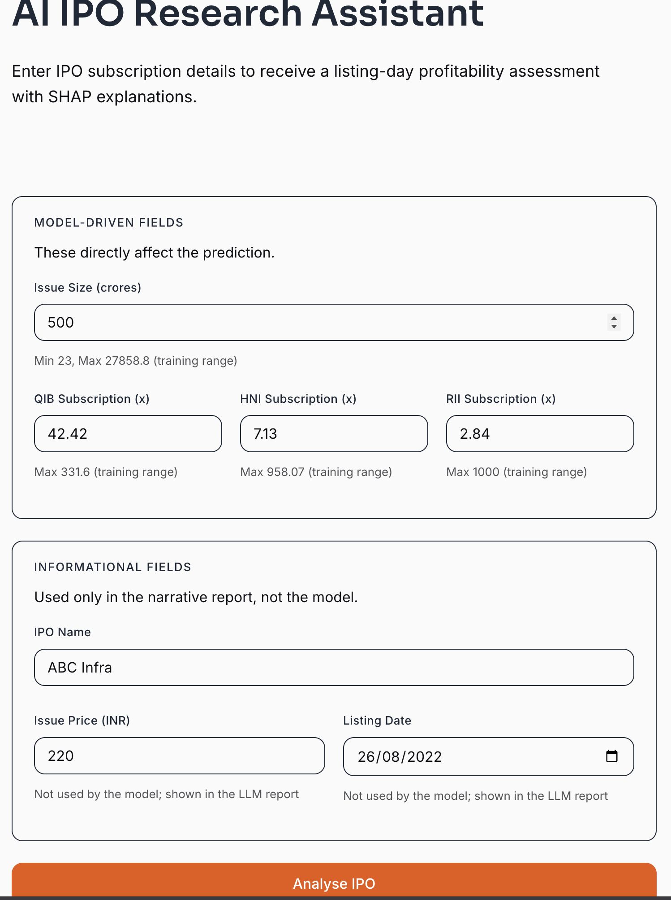
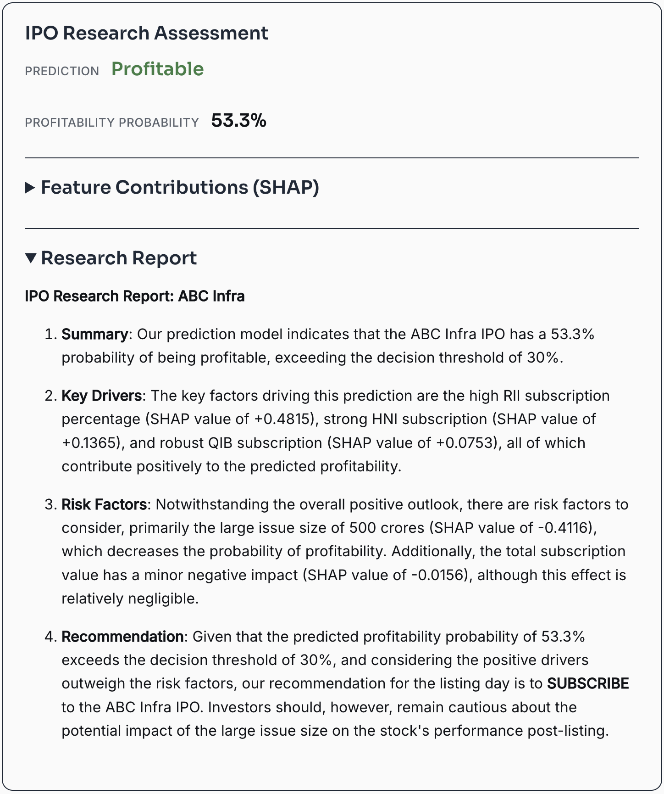

# AI IPO Research Assistant

Predicts Indian IPO listing-day profitability using XGBoost, explains predictions via SHAP, and generates research reports using LLMs.

**Live demo:** [ipo-prediction.onrender.com](https://ipo-prediction.onrender.com)

---

## Why This Project?

IPO subscription data (QIB, HNI, RII) contains strong signals about market sentiment, but most retail investors lack the tools to systematically analyze them. This project combines a trained ML model with explainable AI (SHAP) and LLM-generated reports to provide institutional-grade IPO assessments.

---

## Screenshots





---

## Architecture

```
┌─────────────┐     ┌──────────────┐     ┌─────────────┐     ┌──────────────┐
│   Frontend  │────▶│   FastAPI     │────▶│  XGBoost +  │────▶│  LLM Report  │
│ (Custom UI) │     │   /api/v1/    │     │    SHAP      │     │  (Groq/Gemini│
│             │     │   predict     │     │  Predictor   │     │  /OpenRouter) │
└─────────────┘     └──────────────┘     └─────────────┘     └──────────────┘
```

**Request flow:**
1. User submits IPO subscription data via the frontend form
2. FastAPI validates the input (Pydantic) and passes it to the pipeline
3. XGBoost model predicts profitability probability; SHAP computes per-feature contributions
4. LLM generates a narrative research report (optional — requires API key)
5. Full assessment returned: prediction, probability, SHAP explanations, and report

---

## Features

- **Profitability Prediction** — XGBoost binary classifier with 6 engineered features
- **Explainable AI** — SHAP TreeExplainer provides per-feature contribution explanations
- **LLM Research Reports** — Auto-generated narrative reports via Groq/Gemini/OpenRouter
- **Multi-provider Fallback** — LLM client automatically falls back to the next provider on failure
- **REST API** — FastAPI with Pydantic validation, proper error codes, and OpenAPI docs
- **OOD Input Warnings** — Flags inputs outside the model's training range
- **Frontend** — Custom design-system UI for interactive predictions
- **47 Tests** — Unit tests for schemas, predictor, pipeline, report generator, LLM client, and API endpoints
- **Docker Support** — Production-ready container with docker-compose

---

## Tech Stack

| Layer | Technology |
|-------|------------|
| Model | XGBoost, scikit-learn, SHAP |
| Backend | FastAPI, Pydantic, Uvicorn |
| LLM | Groq / Google Gemini / OpenRouter (with fallback) |
| Frontend | HTML, custom design system (CSS), Marked.js |
| Testing | pytest |
| Container | Docker, docker-compose |

---

## Quick Start

### Local Development

```bash
# Clone the repo
git clone https://github.com/NameRectified/ai-ipo-research-assistant.git
cd ai-ipo-research-assistant

# Create virtual environment
python3 -m venv venv
source venv/bin/activate

# Install dependencies
pip install -r requirements.txt

# Configure LLM API keys (optional — reports skipped without keys)
cp .env.example .env
# Edit .env with your API keys

# Run the server
uvicorn app.main:app --reload
```

Open http://localhost:8000 in your browser.

### Docker

```bash
# Build and run
docker compose up --build

# Or with .env file
cp .env.example .env
docker compose up --build
```

### Running Tests

```bash
# macOS (XGBoost requires DYLD_LIBRARY_PATH)
DYLD_LIBRARY_PATH=/Users/apple/lib pytest tests/ -v

# Linux/Docker
pytest tests/ -v
```

---

## Project Structure

```
ai-ipo-research-assistant/
├── app/
│   ├── api/
│   │   └── schemas.py          # Pydantic request/response models
│   ├── config/
│   │   └── settings.py          # Environment-based configuration
│   ├── services/
│   │   ├── predictor.py         # Model loading, prediction, SHAP explanations
│   │   ├── llm_client.py        # Multi-provider LLM client with fallback
│   │   ├── report_generator.py  # LLM report generation from YAML prompts
│   │   └── pipeline.py          # End-to-end orchestration
│   ├── static/
│   │   ├── index.html           # Frontend
│   │   └── design.css           # Design system styles
│   └── main.py                  # FastAPI application
├── models/
│   └── model.pkl                # Trained XGBoost model artifact
├── prompts/
│   └── report.yaml              # LLM prompt template
├── tests/
│   ├── conftest.py              # Shared fixtures (mock model, test data)
│   ├── test_schemas.py          # Pydantic validation tests
│   ├── test_predictor.py        # Prediction + SHAP tests
│   ├── test_pipeline.py         # Pipeline orchestration tests
│   ├── test_report_generator.py # Prompt formatting tests
│   ├── test_llm_client.py       # Provider fallback tests
│   └── test_api.py              # FastAPI endpoint tests
├── training/
│   └── train.py                 # Model training pipeline
├── assets/                      # Screenshots
├── Dockerfile
├── docker-compose.yml
├── requirements.txt
├── .env.example
└── README.md
```

---

## API

### `POST /api/v1/predict`

Submit IPO subscription data for a profitability assessment.

**Request:**
```json
{
  "ipo_name": "ABC Infra",
  "issue_size": 500,
  "subscription_qib": 42.42,
  "subscription_hni": 7.13,
  "subscription_rii": 2.84,
  "issue_price": 220,
  "listing_date": "2022-08-26"
}
```

**Response:**
```json
{
  "ipo_name": "ABC Infra",
  "prediction": "Profitable",
  "profitability_probability": 0.87,
  "features_used": ["Total_Sub", "QIB", "HNI", "HNI_pct", "RII_pct", "Issue_Size_crores"],
  "shap_explanations": [
    {
      "feature_name": "Total_Sub",
      "feature_value": 52.39,
      "shap_value": 0.1523,
      "impact": "increases_profitability"
    }
  ],
  "research_report": "# IPO Research Assessment\n...",
  "report_generated": true,
  "input_warnings": []
}
```

### `GET /health`

Health check endpoint. Returns `{"status": "ok"}`.

---

## Model Performance

| Metric | Value |
|--------|-------|
| CV AUC | 0.804 ± 0.038 |
| OOF F1 | 0.835 |
| Decision Threshold | 0.30 |
| Features | 6 |
| Training Samples | 559 |

**Final Feature Set:**

| Feature | Importance | Description |
|---------|-----------|-------------|
| Total_Sub | 27.8% | Total subscription multiple (QIB + HNI + RII) |
| QIB | 20.7% | Qualified Institutional Buyer subscription |
| HNI | 18.4% | High Net-worth Investor subscription |
| Issue_Size_crores | 11.4% | Issue size in crores |
| RII_pct | 10.9% | Retail investor share of total subscription |
| HNI_pct | 10.7% | HNI share of total subscription |

---

## Design Decisions

**Why XGBoost?**
Tree-based models handle non-linear relationships in subscription data natively. Feature engineering (ratios) and hyperparameter tuning improved AUC from 0.778 to 0.804.

**Why 6 features?**
Systematic feature pruning (Experiments 4a/4b/4c) showed that removing low-importance features improved F1 from 0.801 to 0.835 while reducing model complexity.

**Why SHAP?**
SHAP provides theoretically grounded feature attributions that explain *why* the model made a prediction — essential for investor-facing applications.

**Why multi-provider LLM?**
Single-provider APIs have rate limits and outages. Automatic fallback ensures report generation stays available.

---

## Dataset

Indian IPO data (2010–2025) from [AadiParkhi/IPO-Data-India-2010-2025](https://github.com/AadiParkhi/IPO-Data-India-2010-2025). 559 IPOs after cleaning.

---

## Future Improvements

- Add sector/industry as a categorical feature
- Incorporate market sentiment (Nifty 50 index at listing)
- Time-series features (IPO pipeline volume per month)
- A/B test threshold optimization by sector
- Redis caching for repeated IPO lookups

---

## License

MIT
